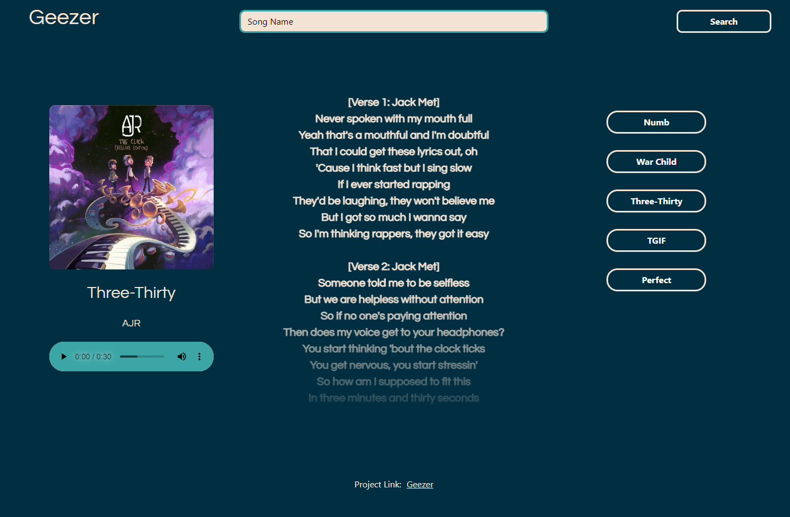

# Project 1 - Geezer Song Lyrics App

## Description

#### Allows users to select and play a track, and see the lyrics printed on screen. Useful if karaoke is your thing, or you're tired of making the words up as you go!

## Usage
#### When user imputs song name followed by enter on the keyboard, this will dynaimcally create HTML elements on the page through the use of server APIs and using the AJAX function to call said APIs. Using JavaScript, we go through the JSON and select the required data to input on page. On the right side of the page buttons render to showcase end users search  history, they can then use these buttons to show previous songs.

 

## Technologies Used
#### Deezer API
#### Genius Song Lyrics API

Click [here](https://alecerf01.github.io/Geezer-Project/) to go to the application.

 

>Below is a screenshot of the appllication.

 

## Future Implementation

#### In the future we will add additional functionality to the search input so it has a separate input field for artists. We will also create a clear button, so end user is able to clear search history.  

 

## Credits
 
#### 
Alexis [(Git)](https://github.com/alecerf01) | David [(Git)](https://github.com/davidklmn)   Chris [(Git)](https://github.com/chrisnofan) | Danny [(Git)](https://github.com/biota-)
 